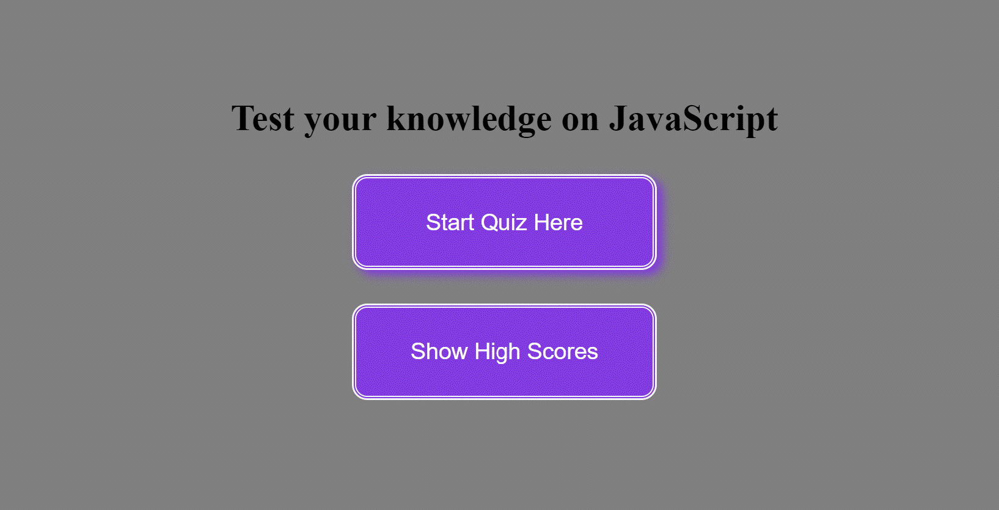
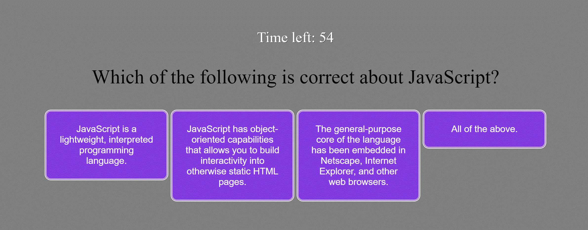
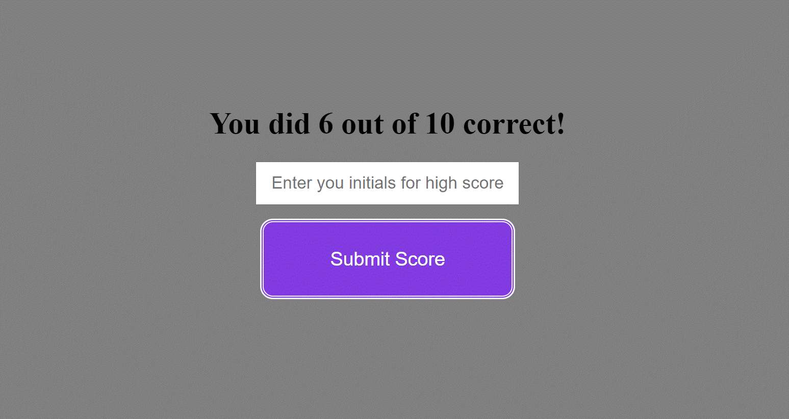

# 04_Web_APIs_Code-Quiz_MR

## Link to deployed application

https://mahbub798.github.io/04_Web_APIs_Code-Quiz_MR/

## Description

As I proceed in my journey to becoming a full-stack web developer, it’s likely that I will be asked to complete a coding assessment, perhaps as part of an interview process. A typical coding assessment is a combination of multiple-choice questions and interactive coding challenges. 

To become familiar with these tests I build a timed coding quiz with multiple-choice questions. This app run in the browser, and feature dynamically updated HTML and CSS powered by JavaScript code. 


## User Story

```
AS A coding boot camp student
I WANT to take a timed quiz on JavaScript fundamentals that stores high scores
SO THAT I can gauge my progress compared to my peers
```


## Acceptance Criteria

```
GIVEN I am taking a code quiz
WHEN I click the start button
THEN a timer starts and I am presented with a question
WHEN I answer a question
THEN I am presented with another question
WHEN I answer a question incorrectly
THEN time is subtracted from the clock
WHEN all questions are answered or the timer reaches 0
THEN the game is over
WHEN the game is over
THEN I can save my initials and score
```


## Mock-Up

The following animation demonstrates the application functionality:





